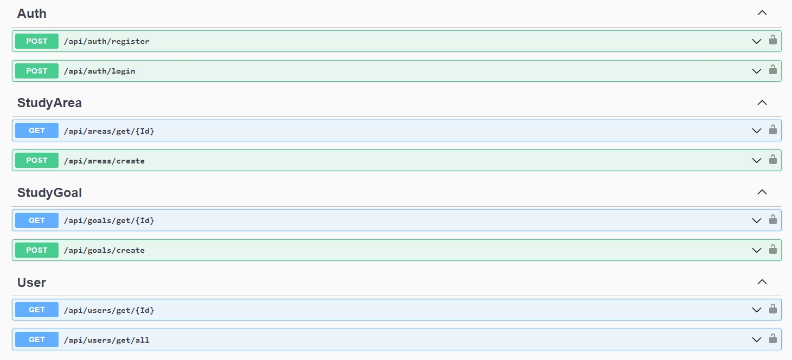
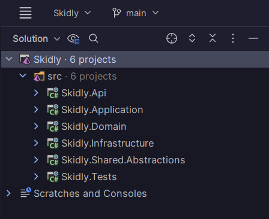

# Skidly

## Application to support learning.

The application is about choosing the areas in which we want to develop, setting
goals to learn, tracking our progress and (possibly in the future) competing
with other users.

## Endpoints

## Project Structure

## General
General requirements and objectives of the project.

### Buzzwords
- Clean Architecture
- Domain-Driven Design
- CQRS
- ASP.NET CORE
- Entity Framework
- SQL Server
- Clean Code (I hope)

### Functionalities
- Users with Roles
- Studying Areas
- Study Goals (short term, long term)
- Pomodoros

## Domain
Application domain layer structure.
The core of whole application.
Here are entities and aggregates that store encapsulated data.
Domain layer cannot see any other layer.

### Application User (aggregate)
- Username
- Email
- Password
- Fullname
- DateOfBirth
- Country
- TotalStudyHours
- StudyAreas

### Roles
- Admininstrator
- User

### Study Area (aggregate)
- Name
- Description
- Goals
- TotalHoursSpentStudying

### Study Goal (aggregate)
- Name
- Description
- Category [short-term, long-term, supplementary]
- Priority
- HoursSpentStudying
- ExpectedTimeToComplete
- Pomodoros
- IsAchieved

### Pomodoro (entity)
- Topic
- ExpectedDuration
- ActualDuration
- StartTime
- EndTime
- IsComplete

## Application
Orchiestrates whole application.
Using MediatR to invoke request handlers.
Using DTOs to provide encapsulated data to response.
Using AuthService to enable logging and registering.

## Infrastructure
Separates frameworks from the business logic.
Here is configuration for Entity Framework Core and ASP.NET Identity.
Here are implementations for all services that connects to the database.

## Shared Abstractions
Here are essential abstractions that are available across whole application.
There are no implementations here, only interfaces and abstract classes.